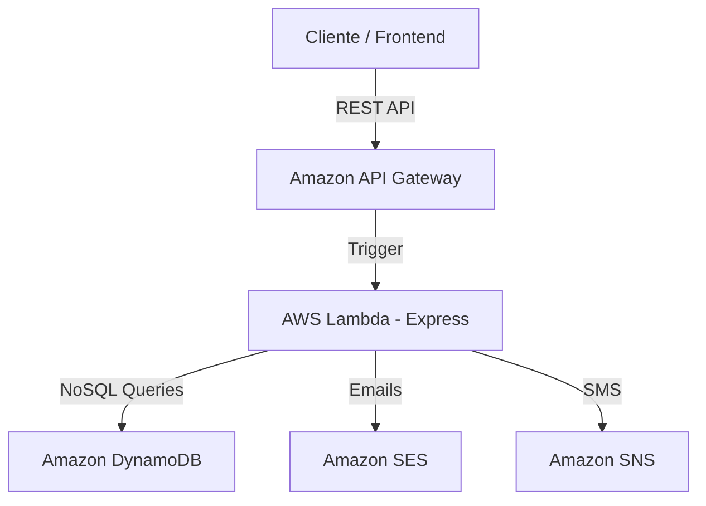

# 🏦 BTG Pactual - Plataforma de Gestión de Fondos

Esta solución es un backend escalable y profesional construido para gestionar fondos de inversión de manera autónoma para los clientes de BTG Pactual.

## 🚀 Tecnologías Utilizadas
- **Node.js 20.x** & **Express**
- **Serverless Framework** (Infraestructura como Código)
- **AWS Lambda** (Cómputo Serverless)
- **Amazon DynamoDB** (Base de Datos NoSQL)
- **Amazon SES** (Notificaciones por Email)
- **Amazon SNS** (Notificaciones por SMS)
- **Jest & Supertest** (Pruebas Unitarias)

## 🏗️ Arquitectura de la Solución

La solución sigue una arquitectura **Layered (Capas)** para asegurar el desacoplamiento y la mantenibilidad:

1.  **API Layer (Express)**: Maneja el enrutamiento, seguridad (Helmet/CORS) y parseo de peticiones.
2.  **Service Layer**: Contiene la lógica de negocio central (validación de saldo, reglas de vinculación mínima, cálculo de balances).
3.  **Repository Layer**: Abstracción de acceso a datos utilizando DynamoDB SDK v3.
4.  **Notification Layer**: Wrapper para servicios de AWS (SES/SNS) permitiendo cambiar el método de notificación fácilmente.

### Diagrama de Infraestructura


## 📂 Estructura de Carpetas
```text
/src
  /handlers      # Handlers de Lambda (index.js/handler.js)
  /services      # Lógica de negocio (FundsService)
  /repositories  # Acceso a datos (DynamoRepository)
  /middleware    # Manejo de errores globales y Auth
  /utils         # Constantes, respuestas formateadas
/tests           # Pruebas unitarias
serverless.yml   # Definición de recursos AWS e Infra como Código
.env.example     # Plantilla de variables de entorno
```

## ⚙️ Configuración y Ejecución Local

### 1. Clonar e Instalar
```bash
npm install
```

### 2. Variables de Entorno
Copia el archivo `.env.example` a `.env` y ajusta las credenciales si es necesario.
```bash
cp .env.example .env
```

### 3. Ejecutar en Desarrollo
```bash
npm run dev
```

### 4. Ejecutar Pruebas
```bash
npm test
```

## ☁️ Despliegue en AWS
Para desplegar toda la infraestructura (API Gateway, Lambdas, Tablas DynamoDB, Roles IAM):
```bash
# Asegúrate de tener configurado tu AWS CLI
serverless deploy
```

## 📝 Reglas de Negocio Implementadas
- **Saldo Inicial**: COP $500,000 por usuario (auto-inicializado en el primer acceso).
- **Validación de Saldo**: No permite suscripciones si el saldo es menor al monto mínimo del fondo.
- **Identificadores Únicos**: Cada transacción genera un UUID único.
- **Notificaciones Dinámicas**: Se envía notificación por el canal preferido (EMAIL o SMS) configurado en el perfil del usuario.
- **Historial**: Consulta de todas las operaciones realizadas (Aperturas y Cancelaciones).

## 📊 Postman
Se incluye el archivo `BTG_Pactual_Funds.postman_collection.json` en la raíz del proyecto para realizar pruebas de los endpoints.
